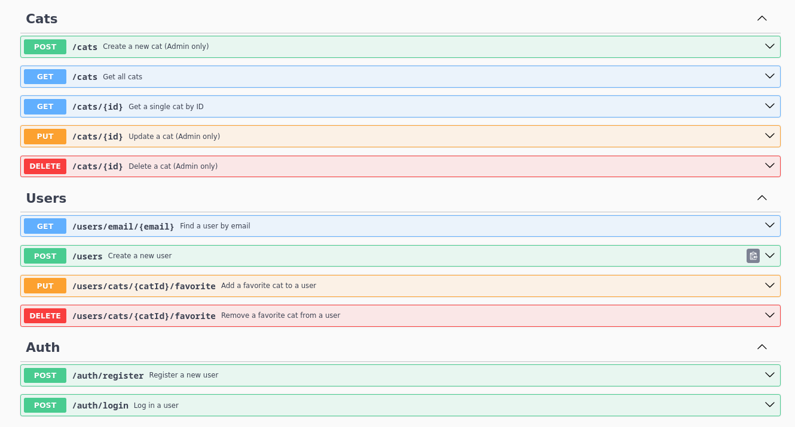

# Cat Adoption Agency API

## Overview

This project is a RESTful API developed with NestJS for a cat adoption agency to manage cat profiles and user interactions. The API features functionalities for handling cat profiles, user authentication, and managing favorite cats.

## Technologies Used
  - NestJS: A progressive Node.js framework for building efficient and scalable server-side applications.
  - PostgreSQL: A powerful, open-source object-relational database system.
  - Passport.js: Middleware for user authentication using JWT tokens.
  - class-validator: Used for input validation.
  - class-transformer: Used for data serialization.
  - Swagger: Documentation generator for API endpoints integrated into NestJS.
  - Docker: Used for containerizing the application and running end-to-end tests.

## Features
  - Cat Profiles: Create, read, update, and delete cat profiles.
  - User Authentication: Secure registration and login functionalities.
  - Favorites: Allows authenticated users to mark cats as favorites.

## API Endpoints

  

  - POST /auth/register: Register a new user.
  - POST /auth/login: Authenticate a user and return a JWT.
  - GET /cats: Retrieve a list of all cats.
  - POST /cats: Create a new cat profile (admin only).
  - GET /cats/{id}: Retrieve a cat profile by ID.
  - PUT /cats/{id}: Update a cat profile by ID (admin only).
  - DELETE /cats/{id}: Delete a cat profile by ID (admin only).
  - PUT /users/cats/:catId/favorite: Mark a cat as favorite by a user.
  - DELETE /users/cats/:catId/favorite: Remove a cat from a user's favorites.

## Getting Started

These instructions will get you a copy of the project up and running on your local machine for development and testing purposes.

## Prerequisites
  - Node.js
  - PostgreSQL
  - Docker

## Setting Up PostgreSQL

To configure your PostgreSQL database for this project, you can use the following SQL commands:

```
CREATE USER cats_admin WITH PASSWORD 'password very strong';
CREATE DATABASE cats_adoption_database;
ALTER DATABASE cats_adoption_database OWNER TO cats_admin;
GRANT ALL PRIVILEGES ON DATABASE cats_adoption_database TO cats_admin;
GRANT ALL PRIVILEGES ON SCHEMA public TO cats_admin;
GRANT ALL PRIVILEGES ON ALL TABLES IN SCHEMA public TO cats_admin;
```

## Installing

Clone the repository to your local machine:

```
git clone https://github.com/vctt94/cat-adoption-api
```

Navigate into the project directory:

```
cd cat-adoption-api
```

Install dependencies:

```
npm install
```

## Configuring Environment Variables
Create a .env file in the root of the project, there is a `.env.example` for reference, and configure it as follows:

```
# .env file
DATABASE_HOST=localhost
DATABASE_PORT=5432
DATABASE_USERNAME="cats_admin"
DATABASE_PASSWORD="password very strong"
DATABASE_NAME="cats_adoption"
DATABASE_SYNCHRONIZE=true
JWT_SECRET=this is a sup3r s3cr3t
```

## Running the application

To start the server, run:

```
npm run start
```

Which will start the application at `localhost:3000`
## Accessing API Documentation

The API documentation, powered by Swagger, is available via `localhost:3000/docs/api` endpoint once the server is running. This provides a detailed description of all the API endpoints, including expected parameters and response structures.

## Running Tests

### Integration tests

To run end-to-end tests using Docker, follow these steps to ensure your environment is set up correctly:

#### Navigate to the e2e directory:

Before running the tests, switch to the e2e directory where the Docker Compose configuration (docker-compose.yml) and test setups are located:

```
cd e2e
```

#### Environment Configuration:
Ensure that the .env file within the e2e directory is configured for integration testing. This file should specify all necessary environment variables that differ from the development or production environments.

#### Run the tests:
Execute the following command to start the Docker environment and run the tests. This command first brings down any currently running Docker containers and removes volumes, ensuring that each test run starts with a clean state, and then builds and runs the containers necessary for the tests:

```
docker-compose down -v && docker-compose up --build
```

This setup ensures that your integration testing environment is clean and all components are correctly built for testing each time you run them.

### Unit tests
To run unit tests, execute the following command:

```
npm run test
```

## License
This project is licensed under the MIT License
